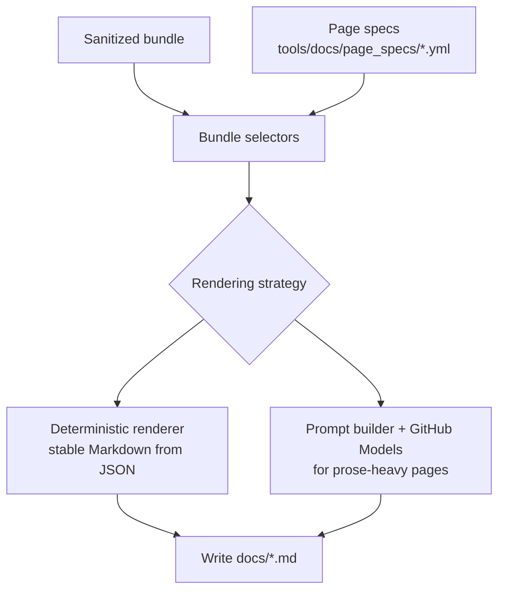

# 🐙 Octo Docs

Public documentation site for the OpenClaw system — a modular AI assistant framework that connects language models to real-world services.

## Live Site

👉 [jeffsteinbok.github.io/octo-docs](https://jeffsteinbok.github.io/octo-docs/)

## What's Here

- **Jekyll site** — Markdown pages published via GitHub Pages (`docs/`)
- **Docs generation system** — bundle-driven pipeline (`tools/docs/`) that turns sanitized facts from a private source repo into public pages

## Documentation System Overview

The docs site is built in **three repos**:

1. **The private `octo` repo** extracts a **sanitized docs bundle**
2. **`openclaw-hub`** publishes a public plugin-detail satellite bundle for mirrored plugins
3. **`octo-docs` (this repo)** merges those bundles and turns them into published Markdown pages

The public docs generator never reads the private source repo directly. It only sees bundle artifacts.

Selected public plugins, services, and shared Python libraries are also mirrored into [`openclaw-hub`](https://github.com/JeffSteinbok/openclaw-hub), which acts as the public source repo for those surfaces.

```mermaid
flowchart LR
    subgraph private["Private source repo"]
        source["Source of truth<br/>plugins, agents, services,<br/>config, jobs, notes"]
        extract["Bundle extractors<br/>tools/docs/extract/*"]
        sanitize["Sanitize + validate<br/>public-safe JSON bundle"]
        artifact["GitHub artifact<br/>docs-bundle"]
        dispatch["repository_dispatch<br/>bundle-ready"]
        source --> extract --> sanitize --> artifact --> dispatch
    end

    subgraph hub["Public source repo: openclaw-hub"]
        hubextract["Build docs-satellite bundle<br/>public plugin detail JSON"]
        hubartifact["GitHub artifact<br/>docs-satellite-bundle"]
        hubdispatch["repository_dispatch<br/>bundle-ready"]
        hubextract --> hubartifact --> hubdispatch
    end

    subgraph public["Public repo: octo-docs"]
        pipeline["Docs Main Pipeline<br/>docs-main-pipeline.yml"]
        validate["Validate public repo<br/>tests + secret scan"]
        download["Download runtime + satellite bundles"]
        generate["Generate/update docs pages<br/>generate-docs.yml"]
        commit["Commit generated Markdown<br/>to octo-docs/main"]
        deploy["Deploy Jekyll site<br/>GitHub Pages"]
        pipeline --> validate --> download --> generate --> commit --> deploy
    end

    dispatch --> pipeline
    hubdispatch --> pipeline
    artifact -. manual/local input .-> download
    hubartifact -. manual/local input .-> download
```

## Repo Responsibilities

| Repo | Responsibility | Output |
|------|----------------|--------|
| `octo` | Source of truth for the live runtime: enabled plugins, agents, jobs, services, changelog data, and runtime inventory | `docs-bundle` artifact |
| `openclaw-hub` | Public source tree for mirrored plugins that should have first-class docs pages | `docs-satellite-bundle` artifact |
| `octo-docs` | Downloads artifacts, merges hub-backed plugin detail into the runtime bundle, generates Markdown, and deploys the site | committed `docs/*.md` plus GitHub Pages deployment |

The split is deliberate:

- `octo` knows **what the live system uses**
- `openclaw-hub` knows **the public plugin detail for mirrored plugins**
- `octo-docs` knows **how to turn public-safe facts into a site**

## End-to-End Flow

### 1. Private repo builds the bundle

When the source repo changes, its docs pipeline:

- extracts structured facts from source files
- removes or rejects private/sensitive data
- writes a sanitized runtime bundle under `out/docs-bundle/`
- uploads that bundle as a GitHub Actions artifact named `docs-bundle`

Typical bundle contents include things like:

- `plugins/*.json`
- `agents/*.json`
- `services.json`
- `libs/*.json`
- `jobs.json`
- `config.json`
- `release/changes.json`
- `manifest.json`
- `changed_pages.json`

### 2. `openclaw-hub` publishes mirrored plugin detail

When mirrored public plugins change, `openclaw-hub` builds a docs-satellite bundle containing deterministic plugin detail chunks such as `plugins/stock-quotes.json`.

This bundle is intentionally narrower than the main runtime bundle. It does **not** try to re-publish the whole system. It only carries the public plugin detail chunks that `octo-docs` can overlay into the main runtime bundle.

### 3. `octo-docs` receives the update signal

`octo` and `openclaw-hub` both send a `repository_dispatch` event (`bundle-ready`) to this repo.

That triggers `.github/workflows/docs-main-pipeline.yml`, which orchestrates three phases:

1. **validate** — run tests and secret scanning in `octo-docs`
2. **generate** — download the bundle and regenerate affected pages
3. **deploy** — publish the resulting site through GitHub Pages

The dispatch payload can come from either source:

- from `octo`: `octo_artifact_name`, `octo_run_id`
- from `openclaw-hub`: `hub_artifact_name`, `hub_run_id`

`octo-docs` fills in the missing side with the default artifact names (`docs-bundle` and `docs-satellite-bundle`) so either upstream repo can re-trigger generation on its own.

### 4. The generator turns bundle facts into pages

The generator lives under `tools/docs/` and uses **page specs** from `tools/docs/page_specs/*.yml`.

Each page spec tells the system:

- which bundle files to read
- where to write the resulting page
- whether the page is rendered deterministically or via an LLM prompt

There are two broad rendering modes:

- **Deterministic bundle renderers** for structured pages like plugins, hooks, skills, scheduled tasks, and service indexes
- **LLM-assisted generation** for pages that still benefit from prose synthesis, using GitHub Models via `GITHUB_TOKEN`

## Bundle Types and Merge Semantics

There are **three bundle states** involved in docs generation:

1. **Primary runtime bundle** from `octo`
2. **Satellite plugin bundle** from `openclaw-hub`
3. **Merged working bundle** inside `octo-docs`

Only the first two are published as upstream artifacts. The merged bundle is **transient**: it exists in the `octo-docs` workflow workspace as `./bundle` after the satellite overlay step runs.

That means there is **not** a third uploaded “merged bundle” artifact right now. The merge happens just-in-time before page generation.

### How plugin overlay works

`tools/docs/bundle/merge_satellite_bundle.py` decides what to copy from the hub satellite bundle by reading `runtime-plugins.json` from the primary bundle.

A plugin gets overlaid from `openclaw-hub` only when its runtime inventory entry says:

- `origin: "openclaw-hub"`
- `docs_mode: "local"`

For each matching plugin id, `octo-docs` expects to find `plugins/<id>.json` in the satellite bundle and copies that file into the primary bundle’s `plugins/` directory before generation starts.

This keeps the responsibilities clean:

- runtime inventory stays authoritative in `octo`
- plugin detail for mirrored plugins stays authoritative in `openclaw-hub`
- the site generator consumes one merged view at generation time

### What `.last_bundle_ref` means now

`.last_bundle_ref` still remains a **single file** in `octo-docs`.

It does not represent “the octo bundle only” or “the hub bundle only.” It represents the last bundle state that the generator used when it wrote the docs currently committed in this repo. In the dual-bundle model, that means it should be treated as referring to the **effective merged input** used for generation.

### 5. Generated docs are committed and deployed

Once generation succeeds:

- updated Markdown is committed back to `octo-docs`
- the Jekyll site is rebuilt
- GitHub Pages serves the new version of the site

That means the live site is always derived from:

**private source repo → sanitized bundle → generated public docs**

## How plugin pages are decided

The plugins section now answers a product question — **what plugins does Octo use, and where are their docs?** — rather than exposing implementation provenance.

At generation time, `runtime-plugins.json` drives the overview page:

- plugins with `docs_mode: "local"` get full pages under `docs/plugins/`
- plugins with external docs stay in the overview and link out
- mirrored hub plugins are treated like normal local plugin pages once their chunk has been overlaid into the working bundle

The live plugins page therefore reflects:

1. the runtime inventory from `octo`
2. the plugin detail chunks present after the hub merge
3. the current page-generation templates in `octo-docs`

The page intentionally focuses on the plugin catalog and correct links, not which repo a plugin came from.

## Workflow Map

### `octo`

`octo/.github/workflows/docs-bundle.yml`

- builds the sanitized runtime bundle
- uploads `docs-bundle`
- dispatches `bundle-ready` to `octo-docs`

### `openclaw-hub`

`openclaw-hub/.github/workflows/docs-satellite-bundle.yml`

- builds mirrored plugin outputs if needed
- builds the satellite bundle
- uploads `docs-satellite-bundle`
- dispatches `bundle-ready` to `octo-docs`

### `octo-docs`

`.github/workflows/docs-main-pipeline.yml`

- resolves how the run was triggered
- decides whether to validate, generate, and deploy
- invokes the reusable generator workflow

`.github/workflows/generate-docs.yml`

- downloads `octo` and/or `openclaw-hub` artifacts
- merges hub plugin detail into the working bundle
- runs `tools/docs/generation/generate_all.py`
- commits generated docs back to `main`

## Manual Recovery / Rebuild Paths

If the automatic trigger chain is not enough, `octo-docs` can still be driven manually.

### Rebuild from the latest artifacts

Run `Docs Main Pipeline` or `Generate Public Docs` from the Actions tab and keep the default artifact names:

- `docs-bundle`
- `docs-satellite-bundle`

### Rebuild from specific workflow runs

Provide:

- `artifact_run_id` for the `octo` bundle run
- `hub_artifact_run_id` for the `openclaw-hub` satellite run

This is the easiest way to reproduce a site from a known pair of upstream artifacts.

### Rebuild locally

1. produce or download the `octo` bundle into a local directory
2. produce or download the `openclaw-hub` satellite bundle
3. merge the satellite bundle into the primary bundle
4. run `tools/docs/generation/generate_all.py` against the merged directory

In local experiments, the merged bundle is just a filesystem directory. There is no special required format beyond the normal bundle layout plus any overlaid `plugins/*.json` files.

## Why the split exists

This architecture keeps the public docs useful **without exposing the private repo**.

- the private `octo` repo stays the source of truth for the running system
- selected public plugins, services, and shared libs are mirrored to `openclaw-hub` for direct source browsing
- `octo-docs` only sees public-safe extracted data
- generation logic can evolve independently from the private runtime code
- docs can mix deterministic pages with LLM-generated narrative while staying anchored to structured facts

## Repo Pointers

| Path | Purpose |
|------|---------|
| `docs/` | Published Jekyll site content |
| `tools/docs/generation/` | Main page-generation logic |
| `tools/docs/bundle/merge_satellite_bundle.py` | Overlay hub plugin chunks into the working bundle |
| `tools/docs/page_specs/` | Page definitions: sources, output paths, strategies |
| `.github/workflows/docs-main-pipeline.yml` | Top-level orchestrator for validate/generate/deploy |
| `.github/workflows/generate-docs.yml` | Bundle download + page generation workflow |
