# 🐙 Octo Docs

[](https://github.com/JeffSteinbok/octo-docs/actions/workflows/docs-main-pipeline.yml)

Public documentation site for the OpenClaw system — a modular AI assistant framework that connects language models to real-world services.

## Live Site

👉 [jeffsteinbok.github.io/octo-docs](https://jeffsteinbok.github.io/octo-docs/)

## What's Here

- **Jekyll site** — Markdown pages published via GitHub Pages (`docs/`)
- **Receive & deploy pipeline** (`.github/workflows/`) that ingests pre-rendered pages from the private source repo and publishes them

## Documentation System Overview

The docs site is built across **two repos**:

1. **The private `octo` repo** extracts facts from its source tree **and renders the final Jekyll Markdown pages**
2. **`octo-docs` (this repo)** receives those rendered pages, scans them, and deploys the site

> **Rendering moved upstream.** All page generation (bundle loading, page specs,
> deterministic renderers) now lives in `octo` under `tools/docs/render/`. This
> repo no longer contains any rendering code — it only receives and deploys.

The public deploy pipeline never reads the private source repo directly. It only sees the rendered `docs-site` artifact.

External plugins (those in standalone repos like [`carapace-stock-quotes`](https://github.com/JeffSteinbok/carapace-stock-quotes) or [`openclaw-hub`](https://github.com/JeffSteinbok/openclaw-hub)) are listed in the plugin overview and link out to their GitHub repos — they do not get locally-generated detail pages.

```mermaid
flowchart LR
    subgraph private["Private source repo (octo)"]
        source["Source of truth<br/>plugins, agents, services,<br/>config, jobs, notes"]
        extract["Extractors + sanitize<br/>tools/docs/extract, sanitize"]
        render["Render Jekyll Markdown<br/>tools/docs/render/render_site.py"]
        artifact["GitHub artifact<br/>docs-site"]
        dispatch["repository_dispatch<br/>docs-site-ready"]
        source --> extract --> render --> artifact --> dispatch
    end

    subgraph public["Public repo: octo-docs"]
        pipeline["Docs Main Pipeline<br/>docs-main-pipeline.yml"]
        scan["Secret scan<br/>TruffleHog"]
        receive["Receive rendered pages<br/>generate-docs.yml"]
        commit["Commit pages<br/>to octo-docs/main"]
        deploy["Deploy Jekyll site<br/>GitHub Pages"]
        pipeline --> scan --> receive --> commit --> deploy
    end

    dispatch --> pipeline
    artifact -. manual/local input .-> receive
```



## Repo Responsibilities

| Repo | Responsibility | Output |
|------|----------------|--------|
| `octo` | Source of truth for the live runtime, **and** rendering of the public docs pages from sanitized facts | `docs-site` artifact (final Markdown) |
| `octo-docs` | Receives the rendered pages, secret-scans them, and deploys the site | committed `docs/*.md` plus GitHub Pages deployment |

The split is deliberate:

- `octo` knows **what the live system uses** and **how to render it**
- `octo-docs` owns **publishing** — secret scanning, committing, and GitHub Pages

## End-to-End Flow

### 1. Private repo builds and renders the site

When the source repo changes, its docs pipeline (`octo/.github/workflows/docs-bundle.yml`):

- extracts structured facts from source files
- removes or rejects private/sensitive data
- **renders the final Jekyll Markdown pages** into `out/docs-site/`
- validates the rendered output (no secrets / private hosts)
- uploads it as a GitHub Actions artifact named `docs-site`

### 2. `octo-docs` receives the update signal

`octo` sends a `repository_dispatch` event (`docs-site-ready`) to this repo.

That triggers `.github/workflows/docs-main-pipeline.yml`, which orchestrates:

1. **secret-scan** — TruffleHog scan of this repo
2. **receive** — download the `docs-site` artifact and copy the pages into `docs/`
3. **deploy** — publish the resulting site through GitHub Pages

### 3. Received docs are committed and deployed

Once the pages are received:

- the rendered Markdown is committed back to `octo-docs`
- the Jekyll site is rebuilt
- GitHub Pages serves the new version of the site

That means the live site is always derived from:

**private source repo → sanitized facts → rendered pages (in `octo`) → deployed site (here)**

## Workflow Map

### `octo`

`octo/.github/workflows/docs-bundle.yml`

- extracts + sanitizes runtime facts
- renders the final pages (`tools/docs/render/render_site.py`)
- uploads the `docs-site` artifact
- dispatches `docs-site-ready` to `octo-docs`

### `octo-docs`

`.github/workflows/docs-main-pipeline.yml`

- resolves how the run was triggered
- decides whether to scan, receive, and deploy
- invokes the reusable receive + deploy workflows

`.github/workflows/generate-docs.yml` (**Receive Rendered Docs**)

- downloads the `octo` `docs-site` artifact
- copies the pages into `docs/`
- commits them back to `main`

`.github/workflows/secret-scan.yml`

- TruffleHog scan; opens an issue and fails on verified secrets

`.github/workflows/jekyll-gh-pages.yml`

- builds `docs/` with Jekyll and deploys to GitHub Pages

## Manual Recovery / Rebuild Paths

### Rebuild from the latest artifact

Run `Docs Main Pipeline` from the Actions tab with the default artifact name `docs-site`.

### Rebuild from a specific workflow run

Provide `artifact_run_id` for the `octo` render run to reproduce a site from a known upstream artifact.

### Trigger via dispatch

```bash
gh api repos/JeffSteinbok/octo-docs/dispatches \
  --method POST \
  -f event_type=docs-site-ready \
  -F client_payload[artifact_name]=docs-site \
  -F client_payload[octo_run_id]=$OCTO_RUN_ID
```

## Why the split exists

This architecture keeps the public docs useful **without exposing the private repo**.

- the private `octo` repo stays the source of truth for the running system and renders its own pages
- `octo-docs` only ever sees public-safe, already-rendered pages
- publishing concerns (secret scanning, Pages deployment) stay isolated here
- external plugins link out to their own GitHub repos for full documentation

## Repo Pointers

| Path | Purpose |
|------|---------|
| `docs/` | Published Jekyll site content (theme config + received pages) |
| `.github/workflows/docs-main-pipeline.yml` | Top-level orchestrator for scan/receive/deploy |
| `.github/workflows/generate-docs.yml` | Downloads the rendered `docs-site` artifact and commits it |
| `.github/workflows/secret-scan.yml` | TruffleHog secret scan |
| `.github/workflows/jekyll-gh-pages.yml` | Jekyll build + GitHub Pages deploy |

> Rendering code lives in the private `octo` repo under `tools/docs/`
> (`extract/`, `sanitize/`, `render/`, `page_specs/`).
