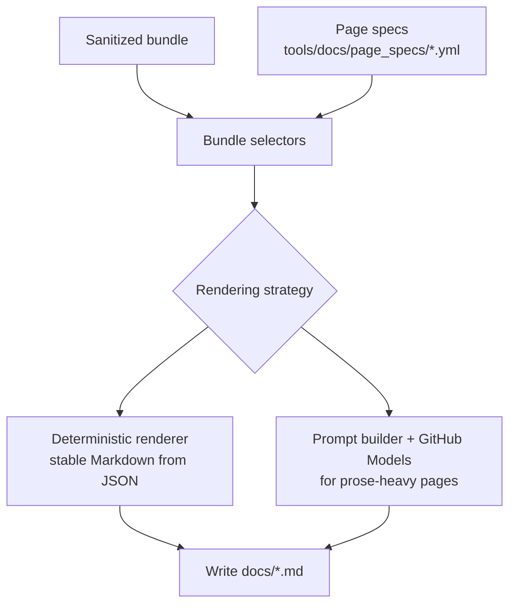

# 🐙 Octo Docs

Public documentation site for the OpenClaw system — a modular AI assistant framework that connects language models to real-world services.

## Live Site

👉 [jeffsteinbok.github.io/octo-docs](https://jeffsteinbok.github.io/octo-docs/)

## What's Here

- **Jekyll site** — Markdown pages published via GitHub Pages (`docs/`)
- **Docs generation system** — bundle-driven pipeline (`tools/docs/`) that turns sanitized facts from a private source repo into public pages

## Documentation System Overview

The docs site is built in **three repos**:

1. **The private `octo` repo** extracts a **sanitized docs bundle**
2. **`openclaw-hub`** publishes a public plugin-detail satellite bundle for mirrored plugins
3. **`octo-docs` (this repo)** merges those bundles and turns them into published Markdown pages

The public docs generator never reads the private source repo directly. It only sees bundle artifacts.

Selected public plugins, services, and shared Python libraries are also mirrored into [`openclaw-hub`](https://github.com/JeffSteinbok/openclaw-hub), which acts as the public source repo for those surfaces.

```mermaid
flowchart LR
    subgraph private["Private source repo"]
        source["Source of truth<br/>plugins, agents, services,<br/>config, jobs, notes"]
        extract["Bundle extractors<br/>tools/docs/extract/*"]
        sanitize["Sanitize + validate<br/>public-safe JSON bundle"]
        artifact["GitHub artifact<br/>docs-bundle"]
        dispatch["repository_dispatch<br/>bundle-ready"]
        source --> extract --> sanitize --> artifact --> dispatch
    end

    subgraph hub["Public source repo: openclaw-hub"]
        hubextract["Build docs-satellite bundle<br/>public plugin detail JSON"]
        hubartifact["GitHub artifact<br/>docs-satellite-bundle"]
        hubdispatch["repository_dispatch<br/>bundle-ready"]
        hubextract --> hubartifact --> hubdispatch
    end

    subgraph public["Public repo: octo-docs"]
        pipeline["Docs Main Pipeline<br/>docs-main-pipeline.yml"]
        validate["Validate public repo<br/>tests + secret scan"]
        download["Download runtime + satellite bundles"]
        generate["Generate/update docs pages<br/>generate-docs.yml"]
        commit["Commit generated Markdown<br/>to octo-docs/main"]
        deploy["Deploy Jekyll site<br/>GitHub Pages"]
        pipeline --> validate --> download --> generate --> commit --> deploy
    end

    dispatch --> pipeline
    hubdispatch --> pipeline
    artifact -. manual/local input .-> download
    hubartifact -. manual/local input .-> download
```

## End-to-End Flow

### 1. Private repo builds the bundle

When the source repo changes, its docs pipeline:

- extracts structured facts from source files
- removes or rejects private/sensitive data
- writes a sanitized runtime bundle under `out/docs-bundle/`
- uploads that bundle as a GitHub Actions artifact named `docs-bundle`

Typical bundle contents include things like:

- `plugins/*.json`
- `agents/*.json`
- `services.json`
- `libs/*.json`
- `jobs.json`
- `config.json`
- `release/changes.json`
- `manifest.json`
- `changed_pages.json`

### 2. `openclaw-hub` publishes mirrored plugin detail

When mirrored public plugins change, `openclaw-hub` builds a docs-satellite bundle containing deterministic plugin detail chunks such as `plugins/stock-quotes.json`.

### 3. `octo-docs` receives the update signal

`octo` and `openclaw-hub` both send a `repository_dispatch` event (`bundle-ready`) to this repo.

That triggers `.github/workflows/docs-main-pipeline.yml`, which orchestrates three phases:

1. **validate** — run tests and secret scanning in `octo-docs`
2. **generate** — download the bundle and regenerate affected pages
3. **deploy** — publish the resulting site through GitHub Pages

### 4. The generator turns bundle facts into pages

The generator lives under `tools/docs/` and uses **page specs** from `tools/docs/page_specs/*.yml`.

Each page spec tells the system:

- which bundle files to read
- where to write the resulting page
- whether the page is rendered deterministically or via an LLM prompt

There are two broad rendering modes:

- **Deterministic bundle renderers** for structured pages like plugins, hooks, skills, scheduled tasks, and service indexes
- **LLM-assisted generation** for pages that still benefit from prose synthesis, using GitHub Models via `GITHUB_TOKEN`

### 5. Generated docs are committed and deployed

Once generation succeeds:

- updated Markdown is committed back to `octo-docs`
- the Jekyll site is rebuilt
- GitHub Pages serves the new version of the site

That means the live site is always derived from:

**private source repo → sanitized bundle → generated public docs**

## Why the split exists

This architecture keeps the public docs useful **without exposing the private repo**.

- the private `octo` repo stays the source of truth for the running system
- selected public plugins, services, and shared libs are mirrored to `openclaw-hub` for direct source browsing
- `octo-docs` only sees public-safe extracted data
- generation logic can evolve independently from the private runtime code
- docs can mix deterministic pages with LLM-generated narrative while staying anchored to structured facts

## Repo Pointers

| Path | Purpose |
|------|---------|
| `docs/` | Published Jekyll site content |
| `tools/docs/generation/` | Main page-generation logic |
| `tools/docs/page_specs/` | Page definitions: sources, output paths, strategies |
| `.github/workflows/docs-main-pipeline.yml` | Top-level orchestrator for validate/generate/deploy |
| `.github/workflows/generate-docs.yml` | Bundle download + page generation workflow |
