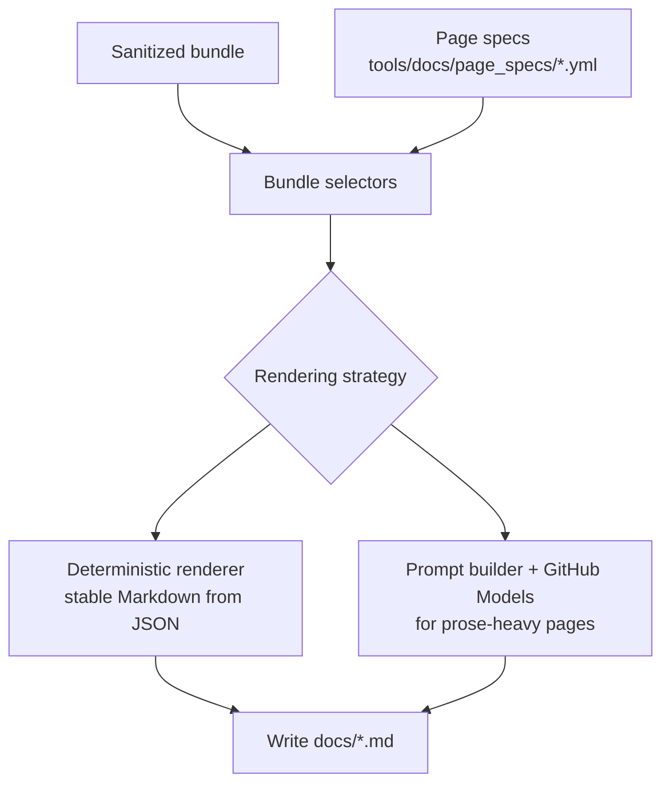

# 🐙 Octo Docs

Public documentation site for the OpenClaw system — a modular AI assistant framework that connects language models to real-world services.

## Live Site

👉 [jeffsteinbok.github.io/octo-docs](https://jeffsteinbok.github.io/octo-docs/)

## What's Here

- **Jekyll site** — Markdown pages published via GitHub Pages (`docs/`)
- **Docs generation system** — bundle-driven pipeline (`tools/docs/`) that turns sanitized facts from a private source repo into public pages

## Documentation System Overview

The docs site is built across **two repos**:

1. **The private `octo` repo** extracts a **sanitized docs bundle** from its source tree
2. **`octo-docs` (this repo)** turns that bundle into published Markdown pages

The public docs generator never reads the private source repo directly. It only sees bundle artifacts.

External plugins (those in standalone repos like [`carapace-stock-quotes`](https://github.com/JeffSteinbok/carapace-stock-quotes) or [`openclaw-hub`](https://github.com/JeffSteinbok/openclaw-hub)) are listed in the plugin overview and link out to their GitHub repos — they do not get locally-generated detail pages.

```mermaid
flowchart LR
    subgraph private["Private source repo (octo)"]
        source["Source of truth<br/>plugins, agents, services,<br/>config, jobs, notes"]
        extract["Bundle extractors<br/>tools/docs/extract/*"]
        sanitize["Sanitize + validate<br/>public-safe JSON bundle"]
        artifact["GitHub artifact<br/>docs-bundle"]
        dispatch["repository_dispatch<br/>bundle-ready"]
        source --> extract --> sanitize --> artifact --> dispatch
    end

    subgraph public["Public repo: octo-docs"]
        pipeline["Docs Main Pipeline<br/>docs-main-pipeline.yml"]
        validate["Validate public repo<br/>tests + secret scan"]
        download["Download bundle"]
        generate["Generate/update docs pages<br/>generate-docs.yml"]
        commit["Commit generated Markdown<br/>to octo-docs/main"]
        deploy["Deploy Jekyll site<br/>GitHub Pages"]
        pipeline --> validate --> download --> generate --> commit --> deploy
    end

    dispatch --> pipeline
    artifact -. manual/local input .-> download
```

## Repo Responsibilities

| Repo | Responsibility | Output |
|------|----------------|--------|
| `octo` | Source of truth for the live runtime: enabled plugins, agents, jobs, services, changelog data, and runtime inventory | `docs-bundle` artifact |
| `octo-docs` | Downloads the bundle, generates Markdown pages, and deploys the site | committed `docs/*.md` plus GitHub Pages deployment |

The split is deliberate:

- `octo` knows **what the live system uses**
- `octo-docs` knows **how to turn public-safe facts into a site**

## End-to-End Flow

### 1. Private repo builds the bundle

When the source repo changes, its docs pipeline:

- extracts structured facts from source files
- removes or rejects private/sensitive data
- writes a sanitized runtime bundle under `out/docs-bundle/`
- uploads that bundle as a GitHub Actions artifact named `docs-bundle`

Typical bundle contents include things like:

- `plugins/*.json`
- `agents/*.json`
- `services.json`
- `libs/*.json`
- `jobs.json`
- `config.json`
- `release/changes.json`
- `manifest.json`
- `changed_pages.json`

### 2. `octo-docs` receives the update signal

`octo` sends a `repository_dispatch` event (`bundle-ready`) to this repo.

That triggers `.github/workflows/docs-main-pipeline.yml`, which orchestrates three phases:

1. **validate** — run tests and secret scanning in `octo-docs`
2. **generate** — download the bundle and regenerate affected pages
3. **deploy** — publish the resulting site through GitHub Pages

### 3. The generator turns bundle facts into pages

The generator lives under `tools/docs/` and uses **page specs** from `tools/docs/page_specs/*.yml`.

Each page spec tells the system:

- which bundle files to read
- where to write the resulting page
- whether the page is rendered deterministically or via an LLM prompt

There are two broad rendering modes:

- **Deterministic bundle renderers** for structured pages like plugins, hooks, skills, scheduled tasks, and service indexes
- **LLM-assisted generation** for pages that still benefit from prose synthesis, using GitHub Models via `GITHUB_TOKEN`

## How plugin pages are decided

The plugins section answers a product question — **what plugins does Octo use, and where are their docs?** — rather than exposing implementation provenance.

At generation time, `runtime-plugins.json` drives the overview page:

- plugins with `docs_mode: "local"` and `has_bundle_page: true` get full pages under `docs/plugins/`
- plugins with external docs stay in the overview and link out to their GitHub repos
- stale child pages are automatically cleaned up by `_cleanup_stale_child_pages()`

Plugin categories on the overview page:

| Section | Description |
|---------|-------------|
| Built-in | Private plugins from the `octo` repo |
| Open Source | Public plugins from standalone carapace repos or openclaw-hub |
| External | Third-party or community plugins |

### 4. Generated docs are committed and deployed

Once generation succeeds:

- updated Markdown is committed back to `octo-docs`
- the Jekyll site is rebuilt
- GitHub Pages serves the new version of the site

That means the live site is always derived from:

**private source repo → sanitized bundle → generated public docs**

## Workflow Map

### `octo`

`octo/.github/workflows/docs-bundle.yml`

- builds the sanitized runtime bundle
- uploads `docs-bundle`
- dispatches `bundle-ready` to `octo-docs`

### `octo-docs`

`.github/workflows/docs-main-pipeline.yml`

- resolves how the run was triggered
- decides whether to validate, generate, and deploy
- invokes the reusable generator workflow

`.github/workflows/generate-docs.yml`

- downloads the `octo` bundle artifact
- runs `tools/docs/generation/generate_all.py`
- commits generated docs back to `main`

## Manual Recovery / Rebuild Paths

### Rebuild from the latest artifact

Run `Docs Main Pipeline` or `Generate Public Docs` from the Actions tab with the default artifact name `docs-bundle`.

### Rebuild from a specific workflow run

Provide `artifact_run_id` for the `octo` bundle run to reproduce a site from a known upstream artifact.

### Rebuild locally

1. Produce or download the `octo` bundle into a local directory
2. Run `tools/docs/generation/generate_all.py` against that directory

## Why the split exists

This architecture keeps the public docs useful **without exposing the private repo**.

- the private `octo` repo stays the source of truth for the running system
- `octo-docs` only sees public-safe extracted data
- generation logic can evolve independently from the private runtime code
- docs can mix deterministic pages with LLM-generated narrative while staying anchored to structured facts
- external plugins link out to their own GitHub repos for full documentation

## Repo Pointers

| Path | Purpose |
|------|---------|
| `docs/` | Published Jekyll site content |
| `tools/docs/generation/` | Main page-generation logic |
| `tools/docs/bundle/` | Bundle loading and selectors |
| `tools/docs/page_specs/` | Page definitions: sources, output paths, strategies |
| `.github/workflows/docs-main-pipeline.yml` | Top-level orchestrator for validate/generate/deploy |
| `.github/workflows/generate-docs.yml` | Bundle download + page generation workflow |