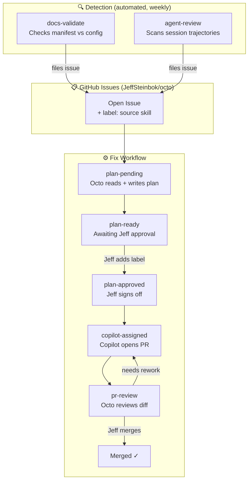

# 🔧 Engineering Harness

The Engineering Harness is the self-improvement loop built into Octo. Detection skills run on a schedule, find problems, and file GitHub issues. A fix workflow then drives each issue from triage through planning, automated fix, and PR review — with GitHub Issues as the single source of truth throughout.



---

## Detection Skills

These run on a weekly cron and file GitHub issues for anything they find. Deduplication is built in — each script checks for existing open issues with its label before filing.

### Docs Validation

**Script:** `tools/docs/scripts/validate_docs.py`
**Cron:** Mondays 6 AM PT
**Label:** `docs-validate`

Validates `config/doc-manifest.json` against the live `openclaw.json` config:

| Severity | Check |
|----------|-------|
| ERROR | Schema — unknown keys, missing required fields, invalid `docsMode` |
| ERROR | Manifest ↔ Config — every manifest plugin must exist in `openclaw.json` |
| WARN | Public but disabled — `public: true` plugin is `enabled: false` in config |
| WARN | Enabled but undocumented — enabled non-provider plugin missing from manifest |

```bash
python3 tools/docs/scripts/validate_docs.py           # run + file issues
python3 tools/docs/scripts/validate_docs.py --dry-run  # preview only
python3 tools/docs/scripts/validate_docs.py --no-issues  # check only
```

### Agent Review

**Skill:** [`agent-review`](/skills/agent-review)
**Script:** `agents/root/scripts/agent_review.py`
**Cron:** Mondays 6 AM PT
**Label:** `agent-review`

Scans session trajectories and memory files for recurring tool failures, missing context patterns, and quality issues. Files issues for actionable findings and delivers a summary to `#root`.

> ⚠️ Known bug: trajectory field names are mismatched ([#210](https://github.com/JeffSteinbok/octo/issues/210)) — cron stats are currently always 0. Fix in progress.

---

## Fix Workflow

Every issue filed in `JeffSteinbok/octo` flows through a label-driven state machine. Octo drives each transition automatically; the only manual step is Jeff adding `plan-approved`.

See **[Issue Lifecycle →](./harness/issue-lifecycle)** for the full state machine with Mermaid diagram and per-state details.
