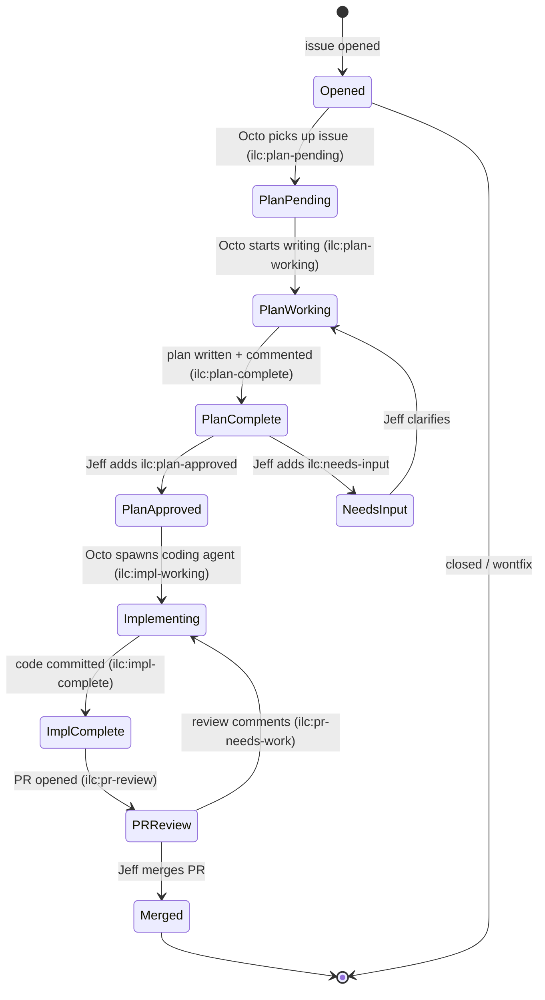

# Issue Lifecycle — State Machine

This document describes the automated lifecycle for issues filed in `JeffSteinbok/octo` — from detection through triage, planning, Copilot fix, PR review, and merge.

---

## State Machine

> ⚠️ **Nothing merges without Jeff's approval.**
> Octo writes plans and reviews PRs, but two manual gates are always required:
> 1. Jeff adds the `ilc:plan-approved` label before any code is written
> 2. Jeff clicks **Merge** on the PR — no auto-merge is configured
>
> Code goes in only when Jeff says so.

---

## Labels

All lifecycle labels are namespaced with the `ilc:` prefix (**i**ssue **l**ife**c**ycle) so they group together and never collide with ad-hoc labels. Only one lifecycle label should be active at a time.

**Plan phase**

| Label | Meaning |
|---|---|
| `ilc:plan-pending` | Plan queued, not yet started |
| `ilc:plan-working` | Octo is actively writing the plan |
| `ilc:plan-complete` | Plan written and commented — awaiting Jeff's review |
| `ilc:needs-input` | Blocked — waiting on info or a decision before proceeding |
| `ilc:plan-approved` | Jeff approved the plan — implementation can start |

**Implementation phase**

| Label | Meaning |
|---|---|
| `ilc:impl-pending` | Implementation queued, not yet started |
| `ilc:impl-working` | Coding subagent is actively implementing |
| `ilc:impl-complete` | Implementation done, PR not yet open |

**PR phase**

| Label | Meaning |
|---|---|
| `ilc:pr-draft` | Draft PR open |
| `ilc:pr-review` | PR ready for Jeff's review and merge |
| `ilc:pr-needs-work` | PR has review comments — needs fixes |

Octo manages transitions automatically; the only labels Jeff adds manually are `ilc:plan-approved` (to proceed) or `ilc:needs-input` (to push back).

---

## What Octo does at each step

### Issue opened
1. Adds `ilc:plan-pending`, then `ilc:plan-working` as it starts
2. Reads the issue body
3. Writes a plan comment — what changes, which files, approach, risks
4. Replaces `ilc:plan-working` with `ilc:plan-complete`
5. Pings Jeff in the issue's `#coding` thread

### `ilc:plan-approved` label added
1. Removes `ilc:plan-complete`
2. Spawns the coding agent into the `#coding` thread; sets `ilc:impl-working`
3. Coding agent implements the fix, commits, sets `ilc:impl-complete`, opens a PR
4. Adds `ilc:pr-review`
5. Pings Jeff in the thread

### PR opened
1. Reads the diff
2. Reviews for correctness, completeness, style
3. Posts a review comment on the PR
4. Ensures `ilc:pr-review` is set on the issue
5. Pings Jeff in the thread

---

## Skill

The coding agent's `issue-lifecycle` skill implements this flow. It is invoked by the `github-issues` webhook hook mapping whenever a relevant issue or PR event fires.

See [`agents/coding/skills/issue-lifecycle/SKILL.md`](../agents/coding/skills/issue-lifecycle/SKILL.md).
