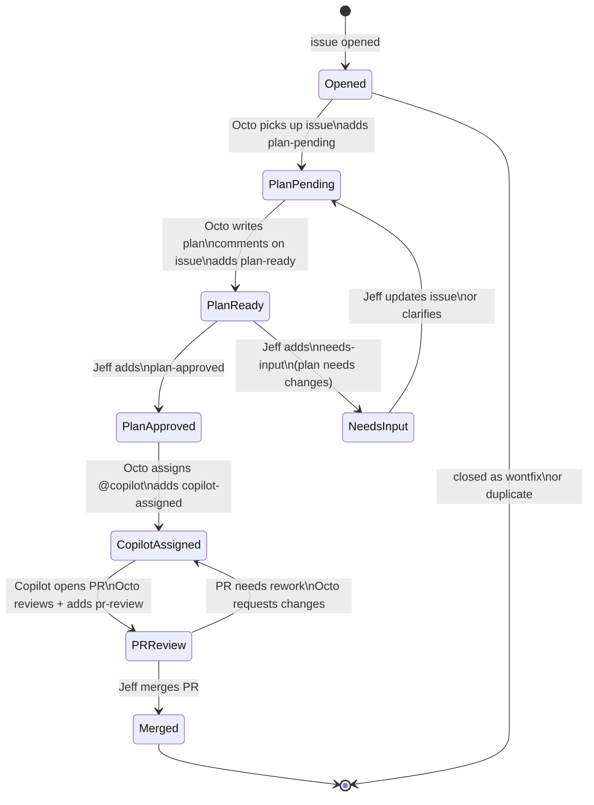

# Issue Lifecycle — State Machine

Every issue filed in [`JeffSteinbok/octo`](https://github.com/JeffSteinbok/octo) flows through an automated state machine — from triage through planning, Copilot fix, PR review, and merge. Octo drives each transition automatically via GitHub webhooks; the only manual step required is Jeff adding the `plan-approved` label.

---

## State Diagram

---

## Labels

| Label | Meaning |
|---|---|
| `plan-pending` | Octo is reading the issue and writing a plan |
| `plan-ready` | Plan written and commented — awaiting Jeff's review |
| `plan-approved` | Jeff approved the plan — Copilot can be assigned |
| `needs-input` | Plan needs changes or clarification before proceeding |
| `copilot-assigned` | Copilot is working on the fix |
| `pr-review` | PR is open — Octo has reviewed and pinged Jeff |

Only one lifecycle label should be active at a time. The only label Jeff needs to add manually is `plan-approved` (or `needs-input` to push back on a plan).

---

## What Octo Does at Each Step

### Issue opened
1. Adds `plan-pending`
2. Reads the issue body
3. Writes a plan comment: what changes, which files, approach, risks
4. Replaces `plan-pending` → `plan-ready`
5. Pings Jeff in `#root`

### `plan-approved` label added
1. Removes `plan-ready`
2. Assigns `@copilot` to the issue
3. Adds `copilot-assigned`
4. Pings Jeff in `#root`

### PR opened by Copilot
1. Reads the diff
2. Reviews for correctness, completeness, style
3. Posts a review comment on the PR
4. Adds `pr-review` to the issue
5. Pings Jeff in `#root`

---

## How It's Wired

- GitHub webhooks fire on issue and PR events → Caddy gateway → OpenClaw hooks endpoint
- The `github-issues` hook mapping routes events to the `coding` agent
- A transform filter (`github-issues.js`) drops pings, bot events, and unrecognised actors
- The coding agent's `issue-lifecycle` skill implements the full state machine
