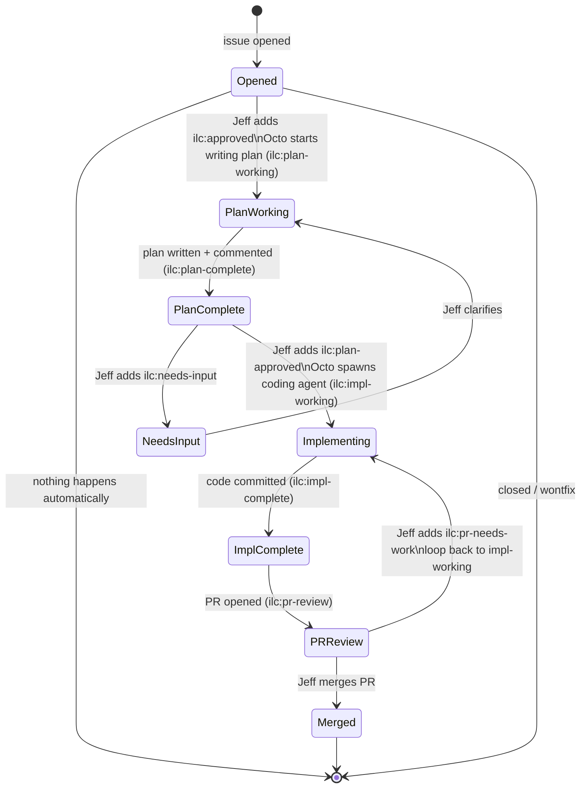

# Issue Lifecycle — State Machine

This document describes the automated lifecycle for issues filed in `JeffSteinbok/octo` — from Jeff's approval through planning, implementation, PR review, and merge.

---

## State Machine

> ⚠️ **Nothing merges without Jeff's approval.**
> Two manual gates are always required:
> 1. Jeff adds `ilc:approved` to kick off planning
> 2. Jeff adds `ilc:plan-approved` to kick off implementation
> 3. Jeff clicks **Merge** on the PR — no auto-merge, ever
>
> Code goes in only when Jeff says so.

```mermaid
stateDiagram-v2
    [*] --> Opened : issue opened

    Opened --> [*] : nothing happens automatically

    Opened --> PlanWorking : Jeff adds ilc:approved\nOcto starts writing plan (ilc:plan-working)

    PlanWorking --> PlanComplete : plan written + commented (ilc:plan-complete)

    PlanComplete --> NeedsInput : Jeff adds ilc:needs-input

    NeedsInput --> PlanWorking : Jeff clarifies

    PlanComplete --> Implementing : Jeff adds ilc:plan-approved\nOcto spawns coding agent (ilc:impl-working)

    Implementing --> ImplComplete : code committed (ilc:impl-complete)

    ImplComplete --> PRReview : PR opened (ilc:pr-review)

    PRReview --> Merged : Jeff merges PR

    PRReview --> Implementing : Jeff adds ilc:pr-needs-work\nloop back to impl-working

    Merged --> [*]
    Opened --> [*] : closed / wontfix
```

---

## Labels

All lifecycle labels are namespaced with the `ilc:` prefix (**i**ssue **l**ife**c**ycle) so they group together and never collide with ad-hoc labels. Only one lifecycle label should be active at a time.

**Plan phase**

| Label | Set by | Meaning |
|---|---|---|
| `ilc:approved` | Jeff | Start planning — Octo picks this up and writes a plan |
| `ilc:plan-working` | Octo | Actively writing the plan |
| `ilc:plan-complete` | Octo | Plan written and commented — awaiting Jeff's review |
| `ilc:needs-input` | Jeff or Octo | Blocked — waiting on info or a decision before proceeding |
| `ilc:plan-approved` | Jeff | Plan approved — implementation can start |

**Implementation phase**

| Label | Set by | Meaning |
|---|---|---|
| `ilc:impl-working` | Octo | Coding subagent is actively implementing |
| `ilc:impl-complete` | Octo | Implementation done, PR not yet open |

**PR phase**

| Label | Set by | Meaning |
|---|---|---|
| `ilc:pr-draft` | Octo | Draft PR open |
| `ilc:pr-review` | Octo | PR ready for Jeff's review and merge |
| `ilc:pr-needs-work` | Jeff | PR has review comments — loop back to impl-working |

---

## What Octo does at each step

### `ilc:approved` label added by Jeff
1. Removes `ilc:approved`, adds `ilc:plan-working`
2. Reads the issue body
3. Writes a plan comment — what changes, which files, approach, risks
4. Replaces `ilc:plan-working` with `ilc:plan-complete`
5. Pings Jeff in the issue's `#coding` thread

### `ilc:plan-approved` label added by Jeff
1. Removes `ilc:plan-complete`, adds `ilc:impl-working`
2. Spawns the coding agent into the `#coding` thread
3. Coding agent implements the fix, commits, sets `ilc:impl-complete`, opens a PR
4. Adds `ilc:pr-review`
5. Pings Jeff in the thread

### `ilc:pr-needs-work` label added by Jeff
1. Removes `ilc:pr-review`, adds `ilc:impl-working`
2. Coding agent reads PR comments, fixes issues, pushes
3. Restores `ilc:pr-review`
4. Pings Jeff in the thread

---

## Skill

The coding agent's `issue-lifecycle` skill implements this flow. It is invoked by the `github-issues` webhook hook mapping whenever a relevant issue or PR event fires.
