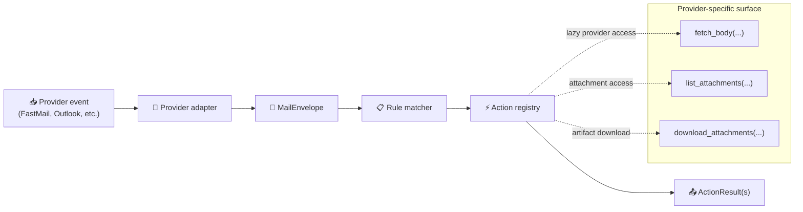

# 📬 Mail Runtime

Provider-agnostic mail processing runtime. Separates **where mail comes from** from **what OpenClaw does with it** — any mail source (FastMail, Outlook, webhooks) shares the same rule engine and action handlers.

Source: [openclaw-hub/libs/ts/mail_runtime_core](https://github.com/JeffSteinbok/openclaw-hub/tree/main/libs/ts/mail_runtime_core)

### Components

| Component | What it does |
|-----------|-------------|
| [USPS Mail Action]({{ site.baseurl }}/mail-runtime/usps) | Informed Delivery parsing, scan-image vision, classification, notifications |
| [Package Tracking Core]({{ site.baseurl }}/mail-runtime/package-tracking) | Carrier detection, tracking URL extraction, storage, status providers |

---

## 📑 Table of Contents

- [Architecture](#architecture)
- [MailEnvelope](#mailenvelope)
- [Rule Engine](#rule-engine)
- [Actions](#actions)
- [Authentication (DKIM/SPF/DMARC)](#authentication-dkimspfdmarc)
- [Provider Protocol](#provider-protocol)
- [Writing a Custom Action](#writing-a-custom-action)
- [Design Decisions](#design-decisions)
- [Rule Examples](#rule-examples)

---

## Architecture



### How it works

1. A **provider adapter** (e.g. FastMail SSE) detects new mail and normalizes it into a `MailEnvelope`
2. The **rule engine** evaluates `mail_rules` in order — matching on sender, subject, domain, etc.
3. Matched rules fire **actions** — named handlers registered in the `ActionRegistry`
4. Actions return **`ActionResult`** values — structured side effects like notifications or agent handoffs
5. The adapter **dispatches** those results into real-world effects (Discord messages, agent calls, etc.)

> The runtime never sends notifications or calls agents directly. All side effects flow through `ActionResult` values that the adapter interprets.

---

## MailEnvelope

The stable contract between providers, rules, and actions:

| Field | Type | Description |
|-------|------|-------------|
| `provider` | `string` | Source identifier (`"fastmail"`, `"outlook"`) |
| `account_id` | `string` | Provider account/mailbox owner |
| `mailbox_id` | `string` | Folder/inbox identifier |
| `message_id` | `string` | Unique message identifier |
| `sender_name` | `string` | Display name of sender |
| `sender_email` | `string` | Email address of sender |
| `subject` | `string` | Normalized subject line |
| `body_text` | `string?` | Plain text body (preloaded or fetched lazily) |
| `body_html` | `string?` | HTML body (preloaded or fetched lazily) |
| `has_attachments` | `boolean` | Cheap hint for rule matching |
| `auth_results` | `AuthResults?` | Parsed DKIM/SPF/DMARC from `Authentication-Results` header |
| `headers` | `Record<string, string>` | Normalized headers |
| `raw` | `unknown` | Original provider payload for adapter-specific needs |

> Actions should prefer normalized fields. Only reach into `raw` when truly provider-specific detail is needed.

---

## Rule Engine

### Rule structure

```json
{
  "mail_rules": [
    {
      "id": "shipping-tracking",
      "accounts": ["u54e940a4"],
      "match": {
        "sender_domain": ["fedex.com", "ups.com"]
      },
      "actions": [{ "name": "detect_tracking" }],
      "continue": true
    }
  ]
}
```

### Rule fields

| Field | Required | Description |
|-------|:--------:|-------------|
| `id` | ✅ | Human-readable identifier for logs/debugging |
| `enabled` | | Boolean; disabled rules are skipped (default: `true`) |
| `providers` | | Provider filter (`["fastmail"]`) |
| `accounts` | | Account filter (`["u54e940a4"]`) |
| `mailboxes` | | Mailbox/folder filter |
| `match` | | Declarative condition block (see below) |
| `actions` | ✅ | Ordered list of actions to execute |
| `continue` | | Keep evaluating subsequent rules (default: `false` — stop at first match) |

### Match conditions

All conditions support **single values or arrays** (array = match any):

| Condition | Description | Example |
|-----------|-------------|---------|
| `sender_email` | Exact email match | `"noreply@amazon.com"` |
| `sender_domain` | Domain match (includes subdomains) | `["fedex.com", "ups.com"]` |
| `sender_name_contains` | Substring match on display name | `"FedEx"` |
| `subject_contains` | Substring match on subject | `["shipped", "delivered"]` |
| `subject_prefix` | Subject starts with | `["accepted:", "declined:"]` |
| `subject_regex` | Regex match on subject | `"Order #\\d+"` |
| `body_contains` | Substring match on body | `["tracking", "shipment"]` |
| `has_attachments` | Boolean presence check | `true` |
| `dkim_pass` | Require DKIM pass | `true` |
| `spf_pass` | Require SPF pass | `true` |
| `dmarc_pass` | Require DMARC pass | `true` |

### Evaluation order

1. Rules are evaluated **top to bottom**
2. First matching rule fires its actions
3. Processing **stops** unless the rule has `"continue": true`
4. Multiple rules can fire for the same message via `continue`

---

## Actions

### Registered actions

| Action | Source | `needs_body` | Description |
|--------|--------|:---:|-------------|
| `notify_email` | Built-in | ❌ | Formats envelope into a notification message |
| `detect_tracking` | Built-in | ✅ | Scans body for tracking numbers/URLs, adds to package tracking |
| `process_usps_digest` | Library (`mail_action_usps`) | ✅ | USPS Informed Delivery: downloads images, runs vision, sends alerts |
| `process_amazon_shipment` | External plugin | ✅ | Amazon shipping: extracts order IDs + tracking, hands off to agent |
| `process_self_email` | External plugin | ✅ | Self-sent email: hands off body as a task to main agent |

### Action configuration in rules

Actions can be a bare string or an object with params:

```json
{
  "actions": [
    "notify_email",
    {
      "name": "process_usps_digest",
      "params": {
        "agent": "main",
        "vision_agent": "mail"
      }
    }
  ]
}
```

### Action source types

| Type | How registered | Lifecycle |
|------|---------------|-----------|
| **Built-in** | `registerBuiltinActions()` at service startup | Always available |
| **Library** | Shared library's `register()` export (e.g. `@openclaw/mail-action-usps`) | Imported at startup |
| **External plugin** | Loaded dynamically from `action_plugins` paths in config | Loaded at startup; adding new paths requires restart |

> External plugins don't need to live in `openclaw-hub`. Any ESM module that exports a `register(registry)` function can be loaded as an action plugin — it just needs to be reachable by path on the host machine.

### ActionResult kinds

Actions emit structured results that adapters dispatch:

| Kind | Meaning | Typical side effect |
|------|---------|---------------------|
| `message` | Notification text to send | Discord/Telegram message |
| `agent_handoff` | Work to delegate to an agent | Agent session created |
| `tracking_update` | Package tracking change | Package list updated |

---

## Authentication (DKIM/SPF/DMARC)

The envelope carries parsed `Authentication-Results` from the provider, enabling rules to gate actions on email authenticity.

### `AuthResults` type

| Field | Values | Description |
|-------|--------|-------------|
| `dkim` | `"pass"` / `"fail"` / `"none"` | DKIM signature verification |
| `spf` | `"pass"` / `"fail"` / `"none"` | SPF sender authorization |
| `dmarc` | `"pass"` / `"fail"` / `"none"` | DMARC policy evaluation |
| `raw` | `string` | Full `Authentication-Results` header for debugging |

### Example: only process verified self-emails

```json
{
  "id": "self-email-command",
  "match": {
    "sender_email": "me@example.com",
    "dkim_pass": true,
    "spf_pass": true
  },
  "actions": [{ "name": "process_self_email" }]
}
```

**Why this matters:** Without DKIM/SPF checks, an attacker could forge a `From:` header and trigger sensitive actions through your assistant. Always gate sensitive actions on authentication.

---

## Provider Protocol

Adapters implement `MailProviderClient` to bridge provider-specific I/O:

| Method | Purpose | When called |
|--------|---------|-------------|
| `fetch_body(envelope)` | Fills in `body_text` / `body_html` | When an action declares `needs_body: true` |
| `list_attachments(envelope)` | Returns lightweight attachment metadata | When action needs attachment info |
| `download_attachments(envelope, filter, dir)` | Materializes files into a workspace directory | When action needs actual files |

> This keeps rule evaluation fast — expensive provider calls only happen when an action explicitly needs them.

### Adapter responsibilities

| Responsibility | What it does |
|----------------|-------------|
| 🔍 Detect new mail | Poll, stream, or receive provider events |
| 📨 Normalize message | Map provider fields → `MailEnvelope` |
| 🔌 Provide lazy access | Implement `MailProviderClient` |
| ⚡ Register actions | Wire built-in + library + external actions |
| 📤 Dispatch results | Route `ActionResult` values to real side effects |

---

## Writing a Custom Action

### Plugin interface

```typescript
export interface ActionPlugin {
  register(registry: ActionRegistry): void | Promise<void>;
}
```

### Minimal example

```typescript
import type { ActionPlugin, ActionRegistry } from '@openclaw/mail-runtime-core';

export const register: ActionPlugin['register'] = (registry) => {
  registry.register('my_custom_action', async (ctx, params) => {
    const body = await ctx.fetchBody();
    const summary = `Got mail from ${ctx.envelope.sender_name}: ${ctx.envelope.subject}`;
    return [{ kind: 'message', payload: { text: summary } }];
  }, { needs_body: true });
};
```

### ActionContext

Each action handler receives:

| Property | Description |
|----------|-------------|
| `envelope` | The `MailEnvelope` for this message |
| `providerClient` | `MailProviderClient` for lazy access |
| `fetchBody()` | Convenience: fetches body into envelope if not already loaded |
| `downloadAttachments(filter, dir)` | Downloads matching attachments |
| `logger` | Scoped logging function |
| `config` | Runtime config object |
| `workspace` | Filesystem workspace path |

### Loading external action plugins

Add paths to `action_plugins` in your config file:

```json
{
  "action_plugins": [
    "/path/to/my-action-plugin/dist/index.js"
  ]
}
```

The service loads each module at startup and calls its `register()` function. Adding or removing plugin paths requires a service restart.

---

## Design Decisions

### Why provider-agnostic?

Without the shared runtime, every mail source would reimplement rule matching, body fetching, attachment staging, and action registration. The provider-agnostic layer keeps that logic in one place. Adding a new source is an adapter problem, not a pipeline rewrite.

### Why lazy body fetching?

Most rules can match on sender/subject alone (cheap metadata). Body fetching is expensive (API call). By deferring body access until an action explicitly requests it, rule evaluation stays fast for the common case.

### Why ActionResult instead of direct side effects?

Decoupling actions from side effects means:
- Actions are testable in isolation
- The same action works across different adapters
- Adapters control their own notification/dispatch mechanisms

---

## Rule Examples

### Shipping notification tracking

```json
{
  "id": "shipping-tracking",
  "accounts": ["u54e940a4"],
  "match": {
    "sender_domain": ["fedex.com", "ups.com", "orders.costco.com"]
  },
  "actions": [{ "name": "detect_tracking" }]
}
```

### Catch-all notification with fall-through

```json
[
  {
    "id": "detect-tracking",
    "accounts": ["u54e940a4"],
    "actions": [{ "name": "detect_tracking" }],
    "continue": true
  },
  {
    "id": "notify-all",
    "accounts": ["u54e940a4"],
    "actions": [{ "name": "notify_email" }]
  }
]
```

### USPS digest with agent handoff

```json
{
  "id": "usps-digest",
  "match": {
    "sender_domain": "usps.com",
    "subject_contains": ["Informed Delivery", "Daily Digest"]
  },
  "actions": [{
    "name": "process_usps_digest",
    "params": {
      "agent": "main",
      "vision_agent": "mail"
    }
  }],
  "continue": true
}
```
