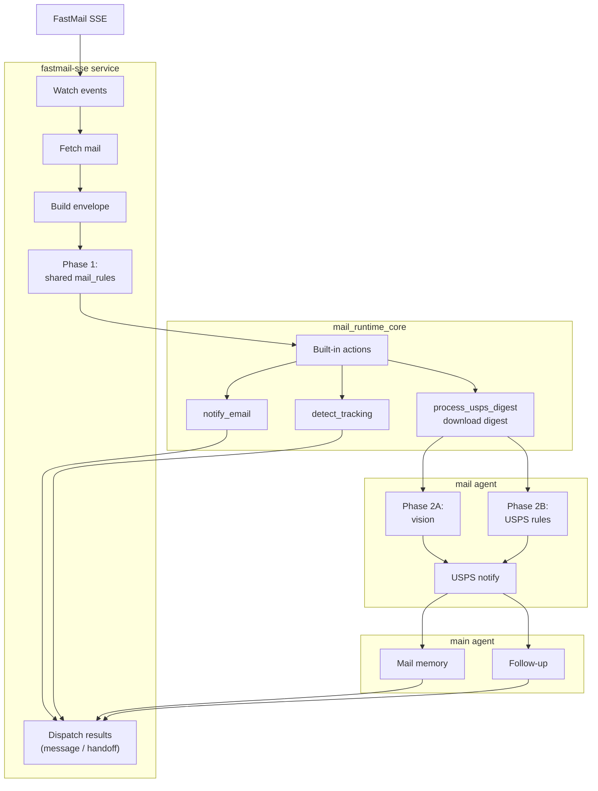

# FastMail SSE Service

Real-time email ingestion daemon that acts as the FastMail-specific adapter over the shared mail runtime. It connects to FastMail's JMAP EventSource, normalizes each new message into a provider-agnostic mail envelope, matches deterministic rules, and invokes shared/runtime-registered mail actions. The current source is FastMail SSE, but the underlying mail runtime is designed to be reused by future Outlook poll/webhook sources.

## Features

- **Shared mail pipeline**: `source -> envelope -> rules -> actions`
- **Deterministic mail rules**: Top-level `mail_rules` for source/account/sender/subject matching
- **Multi-mailbox monitoring**: Monitor personal inbox + shared mailboxes simultaneously
- **Package tracking detection**: Automatically detect and register tracking numbers
- **Meeting updates**: Notify on calendar accept/decline/tentative responses
- **USPS digest processing**: Download images/body HTML, have the mail agent do scan vision, let the USPS runtime send its direct alert, then hand the structured result to main for memory/follow-up
- Connects to JMAP SSE endpoint for real-time state changes
- Skips spam/noreply senders
- Sends notifications via `openclaw message send --channel <NOTIFY_CHANNEL> --target <NOTIFY_TARGET>`

## Mail Pipeline Diagram



**Agent boundaries**

- `mail` agent: owns USPS vision work plus USPS-specific rules/config/state
- `main` agent: owns durable memory and any non-notification follow-up after USPS analysis
- `notify_email` and `detect_tracking` are shared built-in mail actions; FastMail SSE just wires their side effects into the local environment

The USPS path has two rule layers:

1. **FastMail `mail_rules`** decide whether an email should invoke `process_usps_digest`
2. **USPS `rules.json`** classifies each analyzed mailpiece after vision

**USPS sub-phases**

- **Vision analysis (Phase 2A):** USPS scan images are staged to the configured `vision_agent`, which returns structured mailpiece data
- **Post-processing (Phase 2B):** the mail workspace applies USPS rules/config, updates state/history, sends USPS notifications, and prepares any handoff or memory output

## Configuration

### FastMail Config File

Create `~/.openclaw/services/fastmail-sse-config.json` (see `config.example.json` for reference):

```json
{
  "accounts": {
    "<account-id-1>": {
      "label": "assistant@example.com"
    },
    "<account-id-2>": {
      "label": "personal@example.com"
    }
  },
  "mail_rules": [
    {
      "id": "notify-all",
      "accounts": ["<account-id-2>"],
      "actions": [{"name": "notify_email"}]
    }
  ]
}
```

**Account ID**: Your FastMail JMAP account ID (find via JMAP session endpoint or FastMail API docs)

**Label**: Human-readable label for the account (displayed in multi-account notifications)

Generic `mail_rules` syntax, match fields, ordering, and reusable examples live in `libs/ts/mail_runtime_core/`.

### FastMail-exposed actions

This service registers the following shared/domain actions for use in `mail_rules`:

| Action | Behavior |
|------|---------|
| `notify_email` | Formats and sends the email notification |
| `detect_tracking` | Runs the package-tracking extractor/add-remove flow |
| `process_usps_digest` | Downloads image attachments + `body.html`, stages USPS scan vision in the configured vision agent, sends USPS notifications directly, then forwards the structured output to the specified follow-up agent |

### FastMail-specific USPS example

For the USPS internals, agent boundaries, two-phase processing model, and rule/config schemas, see [`libs/ts/mail_action_usps/`](../../libs/ts/mail_action_usps/).

Use a second rule if you want to re-process an older USPS digest by forwarding it to yourself. Forwarded mail usually changes the sender away from `usps.com`, so it needs its own `sender_email`/`body_contains` match.

```json
{
  "accounts": {
    "<account-id>": {
      "label": "personal@example.com"
    }
  },
  "mail_rules": [
    {
      "id": "usps-informed-delivery",
      "accounts": ["<account-id>"],
      "match": {
        "sender_domain": "usps.com",
        "subject_contains": ["Informed Delivery", "Daily Digest"]
      },
      "actions": [
        {
          "name": "process_usps_digest",
          "params": {
            "agent": "main",
            "workspace_agent": "mail",
            "memory_agent": "main",
            "vision_agent": "mail",
            "vision_backend": "auto"
          }
        }
      ],
      "continue": true
    },
    {
      "id": "forwarded-usps-informed-delivery",
      "accounts": ["<account-id>"],
      "match": {
        "sender_email": "you@example.com",
        "subject_contains": ["Informed Delivery", "Daily Digest"],
        "body_contains": ["USPS", "Informed Delivery"]
      },
      "actions": [
        {
          "name": "process_usps_digest",
          "params": {
            "agent": "main",
            "workspace_agent": "mail",
            "memory_agent": "main",
            "vision_agent": "mail",
            "vision_backend": "auto"
          }
        }
      ],
      "continue": true
    },
    {
      "id": "notify-all",
      "accounts": ["<account-id>"],
      "actions": [{"name": "notify_email"}]
    }
  ]
}
```

### Environment Variables

| Variable | Required | Description |
|----------|----------|-------------|
| `FASTMAIL_JMAP_TOKEN` | Yes | JMAP authentication token (or put in `~/.fastmail_token`) |
| `FASTMAIL_INBOX_IDS` | Yes* | Comma-separated mailbox IDs to monitor (e.g., `inbox1,inbox2`) |
| `FASTMAIL_INBOX_ID` | Yes* | Single mailbox ID (legacy, use INBOX_IDS for multiple) |
| `NOTIFY_CHANNEL` | No | Notification channel (default: `discord`) |
| `NOTIFY_TARGET` | Yes | Target ID for the notification channel |

*Either `FASTMAIL_INBOX_IDS` or `FASTMAIL_INBOX_ID` is required.

### FastMail-specific configuration example

#### Multiple Mailboxes (Personal + Shared)

```json
{
  "accounts": {
    "<account-id>": {
      "label": "john@example.com"
    }
  },
  "mail_rules": [
    {
      "id": "track-packages",
      "accounts": ["<account-id>"],
      "actions": [{"name": "detect_tracking"}],
      "continue": true
    },
    {
      "id": "notify-all",
      "accounts": ["<account-id>"],
      "actions": [{"name": "notify_email"}]
    }
  ]
}
```

Environment variables:
```bash
FASTMAIL_INBOX_IDS=personal_inbox_id,shared_team_inbox_id
```

When monitoring multiple mailboxes, notifications include the mailbox name:
```
[Inbox] 📧 John Doe: Meeting tomorrow
[Shared Team] 📧 Jane Smith: Project update
```

## Package Tracking

When `detect_tracking` rule is active, the daemon applies a **rules-based extraction pipeline** — no LLM inference is used per email.

### Extraction Pipeline

For each incoming email the daemon:

1. **Sender allowlist check** — only emails from known shipping carriers and retailers are scanned, avoiding false positives from unrelated emails.  Known senders include `ups.com`, `fedex.com`, `usps.com`, `dhl.com`, `amazon.com`, `narvar.com`, `aftership.com`, `shipbob.com`, `shipstation.com`, `easypost.com`, and the specific address `noreply@nespresso.com`.

2. **Inline regex scan** — scans the email text body for known carrier tracking number patterns:
   - **UPS**: `1Z[A-Z0-9]{16}` (e.g., `1Z999AA10123456784`)
   - **FedEx**: 12, 15, or 20-digit numbers
   - **USPS**: 20-22 digit numbers (often starts with 94, 92, 93, or 95)
   - **Amazon**: `TBA[0-9]{12}US` (e.g., `TBA012345678901US`)

3. **URL parameter extraction** — extracts tracking numbers from shipping/tracking URLs embedded in the email (both the text and HTML bodies), without making any network requests:

   | URL pattern | Example tracking param |
   |-------------|------------------------|
   | `narvar.com/…` | `?tracking_numbers=1Z…` |
   | `ups.com/track…` | `?tracknum=1Z…` |
   | `fedex.com/…track…` | `?trknbr=…` |
   | `usps.com/…` | `?qtc_tLabels1=…` |
   | `amazon.com/…track…` | `?tracking-id=TBA…` |

4. **Narvar link following** — if a `narvar.com` URL is found in the email but the tracking number is not in the URL itself (e.g. Nespresso emails), the daemon performs an HTTP GET of the page and parses the tracking number from the HTML (JSON-LD, JavaScript data objects, or data attributes).

### Automatic package management

- Found packages are added to OpenClaw package tracking with a label like:
  ```
  Personal: Amazon - Order Shipped - Your package is on the way
  ```
- When a delivery confirmation email arrives the corresponding package is automatically removed from tracking.
- Logs each added package: `📦 added package: 1Z999AA10123456784 (UPS) — Personal: …`

View tracked packages: `openclaw tool call --plugin package-tracking --tool package_list`

## Systemd Service

Install: `systemctl --user enable fastmail-sse && systemctl --user start fastmail-sse`

Status: `systemctl --user status fastmail-sse`

Logs: `journalctl --user -u fastmail-sse -f`

## Notification Examples

**General email** (from a catch-all `notify_email` rule):
```
📧 John Doe: Project update for Q1
```

**Meeting response** (from a meeting-only `notify_email` rule):
```
👤 Jane Smith accepted 👍: Team standup meeting
```

**Multi-account** (2+ accounts configured):
```
[Personal] 📧 Amazon: Your order has shipped
[Work] 👤 Bob declined 👎: All-hands meeting
```

**Package detected** (from a `detect_tracking` rule):
```
[fastmail-sse] 📦 added package: 1Z999AA10123456784 (UPS) — Personal: Amazon - Order Shipped
```
