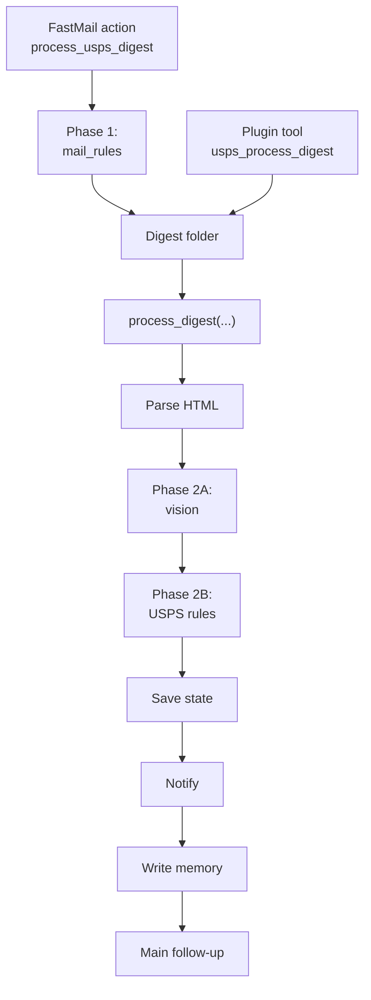

# USPS Mail Runtime

Shared USPS Informed Delivery processing used by both the FastMail mail pipeline and the `usps-mail` plugin.

## What lives here

| Module | Purpose |
|--------|---------|
| `analyze.py` | Main orchestration pipeline for a single digest folder |
| `parse_digest.py` | Parse the USPS HTML digest into structured mail metadata |
| `vision.py` | Ask an OpenClaw agent to analyze each mailpiece image |
| `rules.py` | User-managed importance rules stored in the workspace agent |
| `notify.py` | Build and deliver recipient-specific notifications |
| `memory.py` | Persist analysis history, workflow state, and monthly mail memory |
| `paths.py` | Resolve workspace-owned USPS config/state locations |

## End-to-end flow



The important split is:

- **Phase 1** decides whether the incoming email is a USPS digest worth processing
- **Phase 2A** extracts structured facts from the scan images
- **Phase 2B** applies your personal USPS rules/config to those structured facts

**USPS sub-phases**

- **Vision analysis (Phase 2A):** the `vision_agent` reads each scan image and returns normalized fields like sender, addressee, description, mail class, and address method
- **Post-processing (Phase 2B):** the `workspace_agent` applies `rules.json`, uses `config.json` for routing, persists history/state, and decides what notifications and memory writes happen next

## Entry points

There are two normal ways into this package:

1. **Automatic mail pipeline:** `services/fastmail-sse/usps_integration.py` downloads the digest artifacts, calls `process_digest(...)`, then hands a structured summary to another agent for any follow-up that still matters.
2. **Interactive/manual tooling:** `plugins/usps-mail/src/tools.py` exposes the same shared runtime functions as OpenClaw tools like `usps_process_digest`, `usps_lookup`, and `usps_rules`.

That split is intentional:

- `services/shared_mail_runtime/usps/` owns the USPS workflow itself
- `fastmail-sse` owns FastMail-specific email ingestion and action dispatch
- `plugins/usps-mail` owns the human/operator-facing tool surface

## Agent boundaries

The USPS runtime deliberately splits durable data and work across agents.

| Agent role | What it owns |
|-----------|---------------|
| `workspace_agent` | USPS config, rules, analysis history, workflow state, notification routing config |
| `vision_agent` | Temporary scan-image staging area and the actual vision analysis call |
| `memory_agent` | Long-term searchable markdown memory for processed mail |

### `workspace_agent`

`process_digest(...)` requires a `workspace_agent`. That workspace is the operational home for USPS processing:

- `workspace/usps-mail/rules.json` — classification rules
- `workspace/usps-mail/config.json` — notification routing config
- `workspace/memory/usps_analysis.json` — accumulated analysis history
- `workspace/memory/usps_state.json` — dedup / workflow state

This is usually the **mail agent** workspace, because the mail pipeline owns ongoing USPS operations.

### `vision_agent`

`vision.py` copies each scan image into:

`~/.openclaw/agents/<vision_agent>/workspace/camera_captures/`

Then it invokes:

`openclaw agent --agent <vision_agent> --json --message ...`

The vision agent returns structured JSON for each mailpiece, and the staging image is deleted immediately afterward. This keeps the vision work isolated from the rest of the USPS workflow.

### `memory_agent`

`memory.py` writes monthly markdown summaries under:

`~/.openclaw/agents/<memory_agent>/workspace/memory/mail/`

That long-term memory is meant for the agent that should remember mail over time, which is typically the **main agent** rather than the mail-processing workspace.

## What the pipeline actually does

For one digest folder, `process_digest(...)` runs these stages:

1. Parse `body.html` and detect the delivery date.
2. Find scan images in the folder.
3. Analyze each image through the configured vision backend.
4. Apply user-managed importance rules.
5. Persist structured history in `usps_analysis.json`.
6. Write monthly mail memory markdown when enabled.
7. Build and send notifications based on routing config.
8. Update workflow state for dedup and last-processed tracking.

## Two rule systems, not one

There are two different rule/config layers involved in automatic USPS handling:

| Layer | File | Purpose |
|------|------|---------|
| Mail pipeline trigger rules | `~/.openclaw/services/fastmail-sse-config.json` under `mail_rules` | Decide **when** to invoke the `process_usps_digest` action for an email |
| USPS classification rules | `~/.openclaw/agents/<workspace_agent>/workspace/usps-mail/rules.json` | Decide **how important** each analyzed mailpiece is after vision |

That means:

- `mail_rules` work at the **email/message** level
- USPS `rules.json` works at the **individual mailpiece image** level

## USPS rules structure

`rules.py` loads a versioned JSON file from the workspace agent:

`~/.openclaw/agents/<workspace_agent>/workspace/usps-mail/rules.json`

Shape:

```json
{
  "version": "1.2",
  "rules": [
    {
      "_comment": "Former resident mail is low priority",
      "addressee_contains": "former resident",
      "importance": "low"
    },
    {
      "_comment": "Tax documents are high priority",
      "sender_contains": "county assessor",
      "importance": "high"
    }
  ]
}
```

Supported USPS rule operators are case-insensitive:

| Operator form | Meaning |
|--------------|---------|
| `<field>_contains` | substring must be present |
| `<field>_not_contains` | substring must be absent |
| `<field>_equals` | exact normalized string match |
| `<field>_not_equals` | exact normalized string mismatch |

Supported fields:

- `addressee`
- `sender`
- `description`
- `mail_class`
- `address_method`

USPS rules are **first match wins**. The first matching rule overwrites the item importance and processing moves on.

### Importance values

The USPS rule engine currently works with these importance levels:

- `urgent`
- `high`
- `medium`
- `low`
- `junk`
- `ad`
- `unknown`

### What the rules evaluate

USPS rules run **after** scan-image vision has produced a normalized item like:

```json
{
  "sender": "County Assessor",
  "addressee": "Jane Doe",
  "description": "Property tax assessment notice",
  "type": "scan",
  "importance": "medium",
  "mail_class": "First-Class Mail",
  "address_method": "handwritten"
}
```

So the normal pattern is:

1. vision extracts sender/addressee/description/mail class
2. USPS rules override the default importance based on those fields

## USPS notification config structure

Notification routing config lives at:

`~/.openclaw/agents/<workspace_agent>/workspace/usps-mail/config.json`

Shape:

```json
{
  "routing": {
    "jeff": {
      "channel": "discord",
      "target": "<target-id>"
    },
    "nicole": {
      "channel": "discord",
      "target": "<target-id>"
    },
    "default": {
      "channel": "discord",
      "target": "<target-id>"
    }
  }
}
```

Current behavior from `notify.py`:

- mail addressed to Nicole / Eastside Improv routes to `nicole`
- joint Jeff + Nicole mail routes to `jeff`
- everything else falls back to `jeff`
- if no `routing` block exists, the runtime falls back to `NOTIFY_CHANNEL` / `NOTIFY_TARGET`

Only higher-priority pieces are notified directly; lower-priority items mainly remain in history/memory.

## `process_digest(...)` runtime config

The main USPS pipeline function accepts these important knobs:

| Parameter | Purpose |
|----------|---------|
| `workspace_agent` | required; owns USPS config, rules, history, and workflow state |
| `memory_agent` | required when memory writing is enabled; owns long-term markdown memory |
| `vision_agent` | required when `vision_backend` is `auto`; performs scan-image analysis |
| `vision_backend` | `auto`, `provided`, or `skip` |
| `persist_analysis` | whether to write `usps_analysis.json` |
| `write_memory` | whether to write monthly mail memory |
| `send_notifications` | whether to deliver USPS notifications |
| `update_workflow_state` | whether to update dedup / last-processed state |

The function returns a structured summary with:

- date and mail counts
- per-image structured analysis
- notification plan and send results
- memory file path
- whether analysis/state persistence succeeded

## FastMail companion behavior

When USPS processing runs from the FastMail mail pipeline, the call path is:

`fastmail-sse` email event
→ shared mail runtime rule match
→ `process_usps_digest_action(...)`
→ `shared_mail_runtime.usps.process_digest(...)`

After that shared USPS work finishes, `services/fastmail-sse/usps_integration.py` creates an `agent_handoff` result with a structured JSON payload. That handoff tells the downstream agent:

- the mail agent already handled scan-image vision work
- direct USPS notifications were already routed
- durable mail memory may already have been written
- only non-notification follow-up is still needed

So the mail pipeline uses this package for the heavy USPS-specific work first, and only then asks another agent to reason about any broader follow-up.

## Plugin companion behavior

The `usps-mail` plugin does **not** implement a separate USPS system anymore. Its Python entrypoint imports this package directly and exposes companion tools for:

- processing a digest folder
- searching saved USPS history
- listing/testing/updating rules
- viewing workflow status and summary stats

That keeps one USPS implementation in the shared runtime while still making it available as an interactive tool surface.

## Rule and notification ownership

USPS rule matching here is **not** the same as top-level mail `mail_rules`.

- `mail_rules` decide **when** the mail pipeline should invoke USPS processing
- `usps/rules.py` decides **how important** each individual mailpiece is after the digest is parsed and analyzed

Likewise, USPS notifications are handled here after classification, using routing rules from the workspace agent config.

## Why this split exists

This package sits below both the service and plugin layers because USPS processing needs all of these properties at once:

- reusable by multiple entry points
- stateful across runs
- agent-aware for vision and memory
- separate from provider-specific mail ingestion

That makes `services/shared_mail_runtime/usps/` the right place for the core workflow, while FastMail and the plugin stay thin adapters around it.
