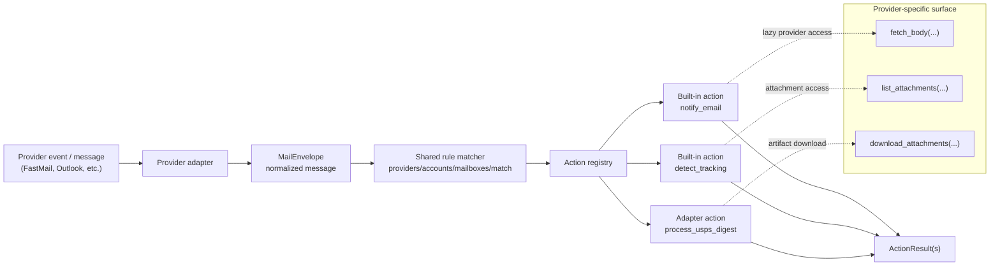

# Mail Runtime Core

Provider-agnostic mail processing runtime used by OpenClaw's mail pipeline. Lives in `libs/python/mail_runtime_core/` so services and plugins can share the same core package without treating it as a service.

## Features

- **MailEnvelope** — Normalized message shape consumed by rules and actions
- **Rule engine** — Declarative JSON rules with match conditions (sender, subject, domain, regex, attachments, body)
- **Action registry** — Named action handlers with automatic body fetching and attachment downloading
- **Provider protocol** — `MailProviderClient` interface that sources implement to plug into the pipeline
- **Built-in actions** — Shared helpers for `notify_email` and `detect_tracking`
- **Adapter-registered actions** — Services can register domain actions such as USPS handling via `process_usps_digest`
- **Result dispatch helper** — Shared routing of `ActionResult` values into adapter-owned side effects

## How provider-agnostic mail works

The shared runtime separates **where mail comes from** from **what OpenClaw does with it**.

- A provider-specific adapter translates raw provider events into a `MailEnvelope`
- The runtime evaluates the same ordered `mail_rules` regardless of provider
- Named actions run against the normalized envelope, not provider-native payloads
- If an action needs more provider data later, it asks the adapter through `MailProviderClient`

That means FastMail SSE, an Outlook poller, or a webhook source can all reuse the same rule engine and action handlers as long as they:

1. identify new messages
2. build a `MailEnvelope`
3. implement the `MailProviderClient` methods
4. pass rules + actions into `execute_rules(...)`

## Provider-agnostic flow



## Source adapter contract

A mail source stays provider-specific only at the edges:

| Adapter responsibility | What it does |
|------|-------------|
| Detect new mail | Poll, stream, or receive provider events |
| Normalize message | Map raw provider fields into `MailEnvelope` |
| Provide lazy access | Implement `MailProviderClient` for body/attachment fetches |
| Register actions | Wire core actions like `notify_email` and `detect_tracking`, plus named adapter actions like `process_usps_digest` from `mail_action_usps`, into the adapter |
| Dispatch results | Decide how `ActionResult` values become service/provider side effects |

In practice, the adapter owns transport, provider APIs, and final side effects; the shared runtime owns matching and reusable action orchestration.

## Related action modules

`mail_runtime_core` stays provider-agnostic. Domain workflows such as USPS should live in separate action modules that register against this runtime.

- [`mail_action_usps`](../mail_action_usps/README.md) — USPS Informed Delivery action module that registers the named action `process_usps_digest`

## Key Types

| Type | Description |
|------|-------------|
| `MailEnvelope` | Normalized message with sender, subject, body, headers, attachments |
| `ActionContext` | Runtime context passed to action handlers (envelope, provider, workspace) |
| `ActionResult` | Structured side effect emitted by an action |
| `MailProviderClient` | Protocol that mail sources implement (fetch body, list/download attachments) |
| `ActionRegistry` | Registry and executor for named mail actions |

## Shared helper modules

| Module | Purpose |
|--------|---------|
| `runtime.py` | Core envelope, rules, registry, and `execute_rules(...)` loop |
| `builtin_actions.py` | Shared registration/helpers for `notify_email` and `detect_tracking` |
| `package_tracking.py` | Mail-envelope adapter over `package_tracking_core` for add/remove flow |
| `result_dispatch.py` | Shared dispatcher fed by adapter-owned side-effect handlers |

### `MailEnvelope`

`MailEnvelope` is the stable contract between providers, rules, and actions. The fields are intentionally generic:

| Field | Meaning |
|------|---------|
| `provider` | Source identifier such as `fastmail` or `outlook` |
| `account_id` | Provider account/mailbox owner identifier |
| `mailbox_id` | Folder/inbox identifier within that provider |
| `sender_name` / `sender_email` | Canonical sender identity |
| `subject` | Normalized subject line |
| `body_text` / `body_html` | Optional body content; can be preloaded or fetched lazily |
| `has_attachments` | Cheap attachment hint for rule matching |
| `raw` | Original provider payload for adapter-specific follow-up |

An action should prefer the normalized fields first and only reach into `raw` when it truly needs provider-specific detail.

### `MailProviderClient`

`MailProviderClient` is the escape hatch for provider-specific I/O without polluting the shared runtime:

- `fetch_body(...)` fills in missing `body_text` / `body_html`
- `list_attachments(...)` exposes lightweight attachment metadata
- `download_attachments(...)` materializes filtered artifacts into a workspace directory

This keeps rule evaluation fast while still letting expensive provider calls happen only when an action requests them.

## Rule Matching

Rules are evaluated in order. Each rule can filter by provider, account, mailbox, and a `match` block supporting:

| Condition | Description |
|-----------|-------------|
| `sender_email` | Exact sender email match |
| `sender_domain` | Domain match (including subdomains) |
| `sender_name_contains` | Substring match on sender name |
| `subject` | Exact subject match |
| `subject_contains` | Substring match on subject |
| `subject_prefix` | Subject starts with value |
| `subject_regex` | Regex match on subject |
| `body_contains` | Substring match on body text/HTML |
| `has_attachments` | Boolean attachment presence check |

By default, processing stops at the first matching rule. Set `"continue": true` on a rule to allow fall-through.

## `mail_rules` shape

The shared runtime expects an ordered list of rule objects. A source adapter decides where that config lives, but the runtime consumes the same structure everywhere.

```json
{
  "mail_rules": [
    {
      "id": "rule-id",
      "providers": ["fastmail"],
      "accounts": ["<account-id>"],
      "mailboxes": ["<mailbox-id>"],
      "match": {
        "sender_domain": "example.com",
        "subject_contains": ["Invoice", "Receipt"]
      },
      "actions": [
        {"name": "notify_email"}
      ],
      "continue": false
    }
  ]
}
```

Common top-level rule fields:

| Field | Meaning |
|------|---------|
| `id` | Human-readable rule identifier for logs/debugging |
| `enabled` | Optional boolean; disabled rules are skipped |
| `providers` | Optional provider filter such as `fastmail` or `outlook` |
| `accounts` | Optional provider-account filter |
| `mailboxes` | Optional mailbox/folder filter |
| `match` | Declarative condition block |
| `actions` | Ordered action list to run when the rule matches |
| `continue` | Keep evaluating later rules after this one |

## Action configuration

Actions can be declared as either a bare name or a `{name, params}` object:

```json
{
  "actions": [
    "notify_email",
    {
      "name": "handoff_to_agent",
      "params": {
        "agent": "main"
      }
    }
  ]
}
```

The shared runtime ships reusable action helpers, but each source adapter still decides which actions it exposes and how result kinds like `message` or `agent_handoff` become real side effects. In practice that means built-in actions such as `notify_email` and `detect_tracking` can sit beside adapter-registered actions such as `process_usps_digest`.

## Common rule examples

These examples show the **generic rule structure**. Actual action availability depends on the integrating service.

### Catch-all notification after a more specific action

```json
{
  "mail_rules": [
    {
      "id": "detect-tracking",
      "accounts": ["<account-id>"],
      "actions": [{"name": "detect_tracking"}],
      "continue": true
    },
    {
      "id": "notify-all",
      "accounts": ["<account-id>"],
      "actions": [{"name": "notify_email"}]
    }
  ]
}
```

Put the more specific rule first and set `"continue": true` if both behaviors should run for the same message.

### USPS digest action

`process_usps_digest` is not a built-in runtime action. It is a **named action registered by the integrating mail source** through `mail_action_usps`.

```json
{
  "mail_rules": [
    {
      "id": "usps-digest",
      "providers": ["fastmail"],
      "match": {
        "sender_domain": "usps.com",
        "subject_contains": ["Informed Delivery"]
      },
      "actions": [
        {"name": "process_usps_digest"}
      ]
    }
  ]
}
```

That action downloads the digest artifacts, runs the USPS workflow, and emits structured results back through the mail adapter.

### Meeting-response notifications only

```json
{
  "mail_rules": [
    {
      "id": "notify-meeting-updates",
      "accounts": ["<account-id>"],
      "match": {
        "subject_prefix": ["accepted:", "declined:", "tentative:"]
      },
      "actions": [{"name": "notify_email"}]
    }
  ]
}
```

### Provider-specific override plus generic fallback

```json
{
  "mail_rules": [
    {
      "id": "usps-fastmail",
      "providers": ["fastmail"],
      "match": {
        "sender_domain": "usps.com",
        "subject_contains": ["Informed Delivery", "Daily Digest"]
      },
      "actions": [{"name": "process_usps_digest"}],
      "continue": true
    },
    {
      "id": "notify-all",
      "actions": [{"name": "notify_email"}]
    }
  ]
}
```

This pattern is useful when one provider exposes richer metadata or special actions, but you still want a generic fallback rule afterwards.

## Action execution model

`execute_rules(...)` does four things:

1. selects matching rules in order
2. creates an `ActionContext` for each action
3. lazily fetches bodies and/or downloads attachments if the action declared those needs
4. returns collected `ActionResult` values to the source adapter

The runtime itself does not send notifications, call agents, or mutate provider state directly. Those side effects are represented as `ActionResult` values and interpreted by the integrating adapter, typically via `result_dispatch.py` plus service-owned handlers.

## Why this split exists

Without the shared runtime, every mail source would need to reimplement:

- subject/body matching
- rule ordering and fall-through
- lazy body fetching
- attachment staging
- action registration

The provider-agnostic layer keeps that logic in one place, so adding a new source is mostly an adapter problem instead of a full pipeline rewrite.

## Related Runtime Docs

- [USPS Mail Runtime](shared-mail-runtime-usps)
